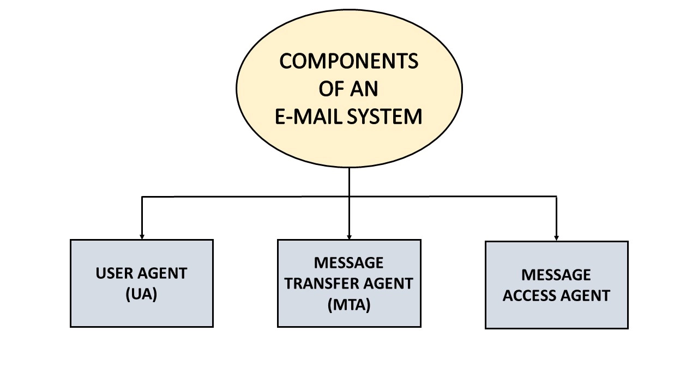
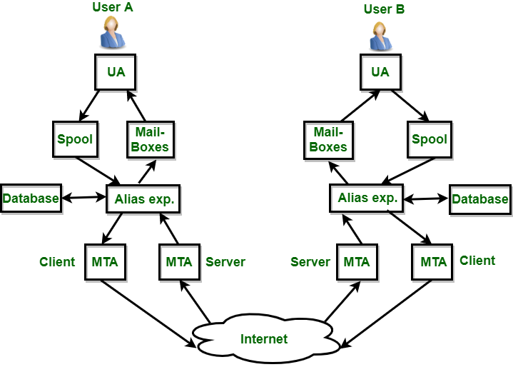
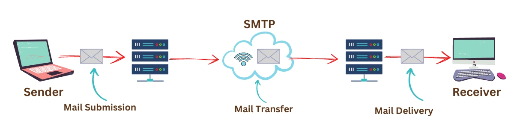
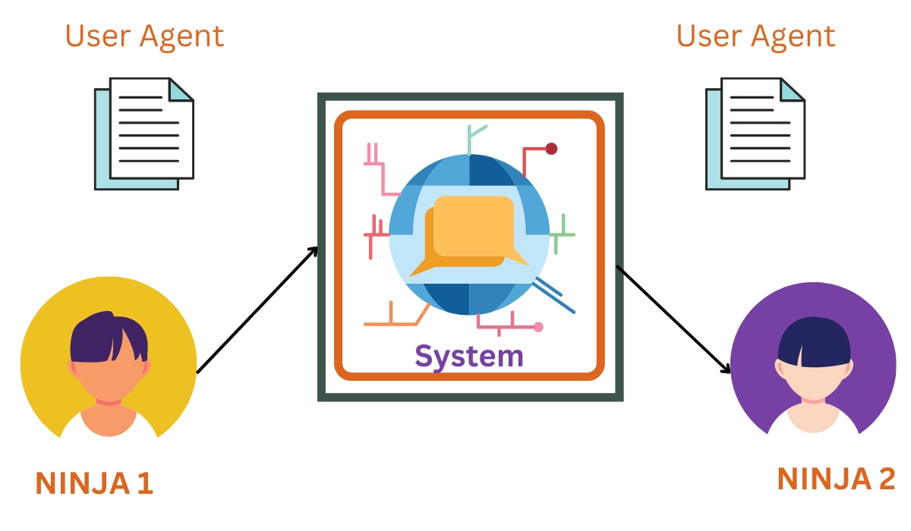
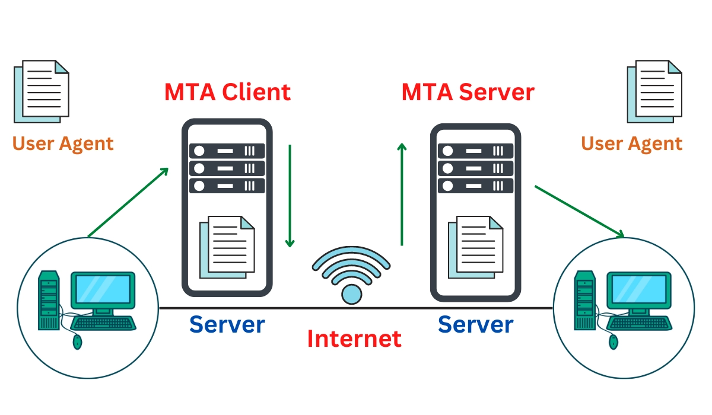
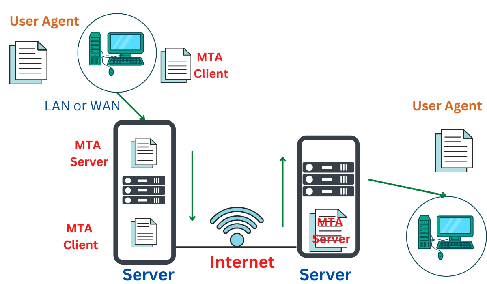
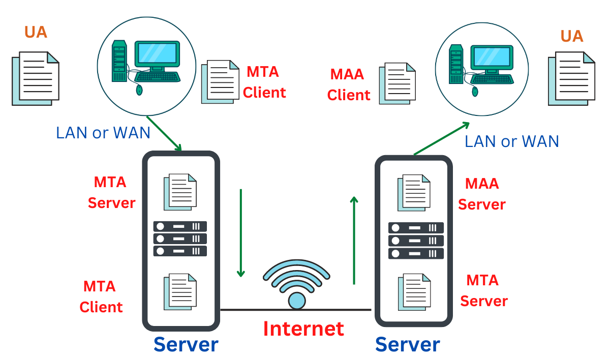

  <h1 style="text-align: center;font-weight: bold">Laporan Praktikum Workshop Administrasi Jaringan</h1>
  <h4 style="text-align: center;">Resume Cara Kerja Mail System</h4>

 

  
  
  
  <h3 style="text-align: center;">Dosen Pengampu:</h3>
  <h4 style="text-align: center;">Dr. Ferry Astika Saputra, S.T., M.Sc.</h4>

  <h3 style="text-align: center;">Disusun Oleh:</h3>
  

    <strong>Zalfail Mumtaza Attamami</strong> 
    <strong>3123600003</strong>
  

<h3 style="text-align: center;line-height: 1.5">Politeknik Elektronika Negeri Surabaya Departemen Teknik Informatika Dan Komputer Program Studi Teknik Informatika 2024/2025</h3>
  

## Apa itu mail?
Adalah program berbasis komputer untuk mengirim dan menerima pesan. E-mail versi elektronik surat, tetapi lebih efektif dan fleksibilitas. Sementara surat dapat memakan waktu mulai dari seminggu hingga beberapa bulan untuk mencapai tujuan yang dituju.

## Komponen surat elektronik
Komponen penting dari sistem e-mail, yakni;
1. User Agen (UA) 
2. Message Transfer Agent (MTA)
3. Message Access Agent
4. Mail box
5. File Spool

### 1. User Agen 
yakni simple software yang mengirim dan menerima email. Selain itu, dikenal sebagai pembaca email. Software User Agen mendukung berbagai instruksi untuk mengirim, menerima, dan membalas pesan serta memanipulasi kotak surat.

Macam-macam layanan User-Agent, yakni;
1. Membaca Pesan
2. Mengirim balasan ke Pesan
3. Komposisi Pesan
4. Meneruskan Pesan
5. Menangani Pesan

### 2. Message Transfer Agent (MTA)
 Yakni mengelola operasi transfer e-mail yang bertanggung jawab untuk mentransfer surat dari satu sistem ke sistem lain. Simple Mail Transfer Protocol (SMTP) mengirimkan pesan dari satu MTA ke MTA lainnya. Suatu sistem harus memiliki MTA klien dan MTA sistem untuk mengirim e-mail. Jika penerima terhubung ke komputer yang sama, sistem akan mengirimkan surat ke kotak surat (mail box). Jika kotak surat tujuan berada di komputer lain, sistem akan mengirimkan surat ke MTA penerima. Pengiriman dari satu MTA ke MTA lain dilakukan oleh Simple Mail Transfer Protocol (SMTP)

 

 ### 3. Message Access Agent
 SMTP digunakan untuk tahap pertama dan kedua pengiriman e-mail. Protokol penarikan diperlukan pada tahap ketiga pengiriman e-mail, dan agen akses pesan. POP dan IMAP4 adalah dua protokol yang digunakan untuk mengakses pesan.

 ### 4. Mail Box
 Berkas hard drive lokal untuk mengumpulkan surat. Surat yang terkirim ada dalam mail box. User bisa membaca dan menghapus sesuai dengan kebutuhan. Untuk menggunakan sistem e-mail, setiap pengguna harus memiliki kotak surat. Akses ke kotak surat hanya dapat dilakukan oleh pemilik kotak surat.

 ### 5. File Spool
 File yang berisi email yang mau dikirim. User Agen menambahkan email keluar dalam file dengan menggunakan SMTP. MTA mengekstrak email yang tertunda dari file spool untuk pengirimannya. Email memungkinkan satu nama, alias, untuk mewakili beberapa alamat email yang berbeda. Namanya Mailing List. Saat user mengirim pesan, sistem memeriksa nama penerima di basis data alias. Jika mail list ada untuk alias yang ditentukan, pesan terpisah, satu untuk setiap entri dalam mail list, harus disiapkan dan diserahkan ke MTA.

 ## Arsitektur Elektronik Mail
 

 1. Pertama, perlu dua User Agen. Pengirim dan penerima email yang terhubung langsung ke server. Program User Agen (UA) digunakan untuk menyiapkan pesan. Setelah itu, email ini disimpan di kotak masuk Ninja2.

 

 2.  Setelah itu, pengirim dan penerima e-mail di dua mesin berbeda melalui internet. Menggunakan Agen USer dan MTA. Misalnya dua user agen, seperti gambar diagram. Saat user 1 mengirim email ke user 2, program UA) dan MTA) menyiapkan email untuk pengiriman melalui internet. Setelah itu, email akan disimpan di mail box user 2.

 

 3. User pengirim terhubung ke sistem dengan WAN point-to-point, bisa berupa modem dial-up atau modem kabel dalam kasus ini. Di sisi lain, penerima terhubung langsung ke sistem, seperti pada skenario kedua. Pengirim juga memerlukan User Agent untuk menyiapkan pesan. Setelah menyiapkan pernyataan, pengirim mengirimkannya melalui LAN atau WAN melalui sepasang MTA.

 

 4. Kemudian, penerima terhubung ke server email melalui WAN atau LAN. Saat pesan tiba, penerima mengambil pesan dengan memerlukan agen klien/server tambahan. Saat ini memerlukan dua agen user (UA), dua pasang agen transfer pesan (MTA), dan beberapa agen akses pesan (MAA).

 

 ## Keuntungan dan Kerugian Mail
 ### Keuntungan email:
 1. Komunikasi yang mudah dan cepat dengan individu atau kelompok di seluruh dunia.
 2. Mudah untuk menyimpan dan mencari pesan-pesan lama.
 3. Dapat mengirim dan menerima lampiran seperti dokumen, gambar, dan video.
 4. Hemat biaya dibandingkan dengan surat dan faks tradisional.
 5. Selalu tersedia
 
 ### Kerugian email:
 1. Risiko serangan spam dan phishing.
 2. Jumlah email yang sangat banyak dapat menyebabkan kelebihan informasi.
 3. Menyebabkan berkurangnya komunikasi tatap muka dan hilangnya sentuhan pribadi.
 4. Potensi miskomunikasi karena kurangnya nada dan bahasa tubuh dalam pesan tertulis.
 5. Masalah teknis, seperti gangguan server, dapat mengganggu layanan email.

 Sumber:
 
 https://www.geeksforgeeks.org/introduction-to-electronic-mail/
 
 https://www.naukri.com/code360/library/electronic-mail-in-computer-networks 