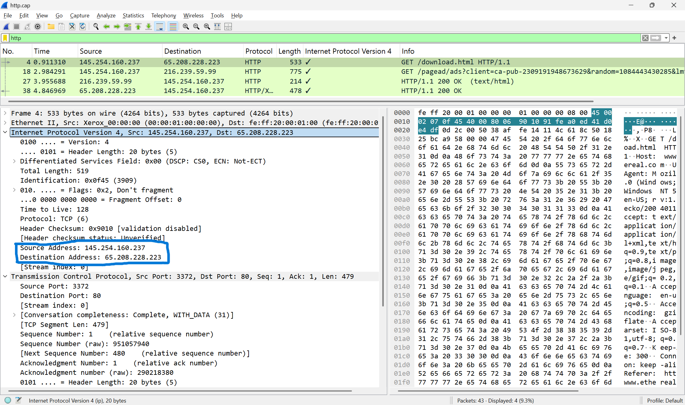
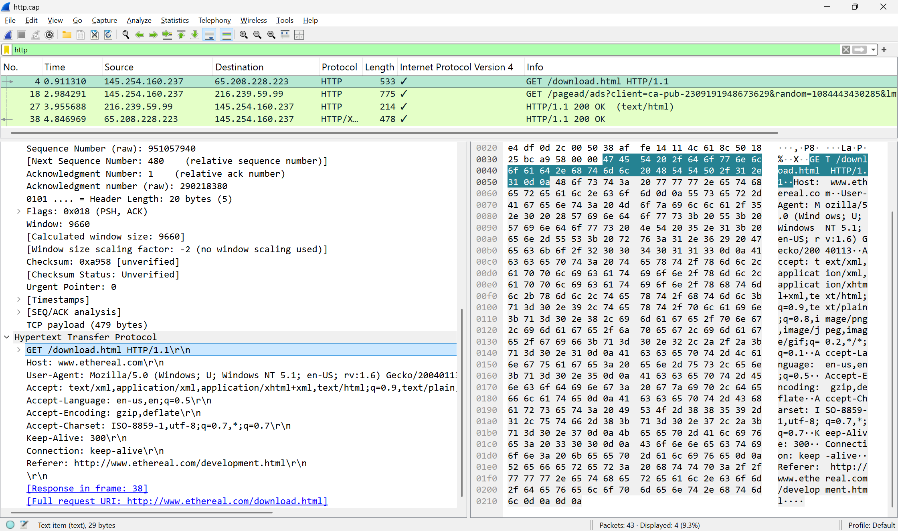
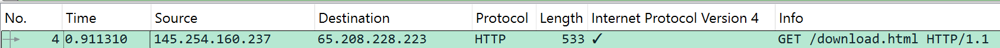
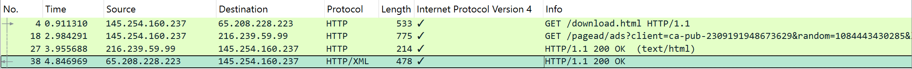

`Nama: Zalfail Mumtaza Attamami`
`NRP: 3123600003`
`Kelas: 2 D4 IT A`
`Mata Kuliah: Administrasi Jaringan`

## 1. Eksplor Wireshark
### 1. IP server dan client
Ketik http di pencaharian, lihat GET pertama. Lalu klik pada Internet Protocols. 
Tertera ada Source IP (IP Client) dan Destination IP (IP Server)
IP Server: 65.208.228.223
IP Client: 145.254.160.237

### 2. Versi HTTP
Pada gambar, tertera bahwa versi HTTPnya yakni HTTP/1.1

### 3. Waktu client mengirim request
Waktu client saat mengirim yakni, 0.911310 

### 4. Waktu server menerima HTTP request dari client
Waktu server saat menerima yakni, 4.846969

### 5. Waktu yang dibutuhkan untuk transfer dan response dari client ke server
Waktu yang dibutuhkan = Waktu Server - Waktu Client
4.846969 - 0.911310 = 3.935659

---

## 2. Proses yang terjadi pada Figure 23.1 Types of data deliveries
Pada figure 23.1 merupakan gambar yang menjelaskan tentang pengiriman data dalam jaringan komputer
Proses pengiriman data, ada 3 tahap. Pertama, di lapisan data link (node to node), data dikirim dari satu perangkat jaringan ke perangkat yang lain di dslam satu segmen jaringan. Kedua, lapisan jaringan (host to host), data bergerak dari satu host ke host lain lewat internet menggunakan alamat IP untuk menentukan jalur pengirimannya. Terakhir, pada lapisan transport (process to process), data dikirim dari satu proses aplikasi di host pengirim ke proses aplikasi di host penerima menggunakan protokol seperti TCP atau UDP untuk memastikan pengiriman yang efektif

1. Data Link Layer (Node to node)
    Merupakan komunikasi antar node/perangkat yang terhubung secara langsung dan beroperasi pada level paling dasar, menangani transfer data antara perangkat yang berdekatan

2. Network Layer (Host to host)
    Network Layer akan mengendalikan komunikasi antara host/komputer pengirim dan penerima. Selain itu, juga mencakup keseluruhan jalur komunikasi dari sumber ke tujuan melalui internet dan bertanggung jawab untuk routing serta pengiriman paket data
3. Transport Layer (Process to process)
    Transport layer untuk mengelola komunikasi antara proses/aplikasi di komputer pengirim dan penerima (server dan client). Lalu, mencakup keseluruhan perjalanan data dari aplikasi sumber ke aplikasi tujuan. Terakhir, memastikan data sampai dengan benar dan terurut

---

## 3. Resume tahapan TCP; Establishment, Data Transfer, Termination
Tahapan TCP, ada 3 fase. Yakni ada Establishment, Data Transfer, dan Termination
1. Tahap Pertama, Pembentukan Koneksi Establishment (Three-Way Handshake) 
    1. Permintaan koneksi SYN
        Client mengirim segmen dengan flag SYN = 1. Selanjutnya, client menetapkan nomor urut awal Initial Sequence Number secara acak (ex: 1000). Kemudian, Header TCP berisi SYN = 1, SEQ = 1000, dan ACK = 0. Lalu status client menjadi SYN-SENT
    2. Persetujuan dan Permintaan Balik SYN-ACK
        Server menerima SYN, lalu menyimpan ISN_Client (1000). Lalu, server membuat ISN_Server sendiri (ex: 2000). Kemudian, server mengirim balasan dengan SYN = 1 (meminta koneksi balik), ACK = 1 (accept permintaan client), SEQ = 2000 (nomor urut awal server), ACK = 1001 (merupakan jumlah dari ISN_Client + 1). Terakhir, status server berubah menjadi SYN_RECEIVED
    3. Konfirmasi akhir ACK
        Awalnya, client menerima SYN-ACK dari server lalu mengirim segmen dengan ACK = 1 (accept pesan server), SYN = 0 (tidak ada koneksi baru), SEQ = 1001 (penjumlahan dari ISN_Client + 1), dan ACK = 2001 (penjumlahan ISN_Server + 1). Kemudian, status client menjadi ESTABLISHED dan yang status server setelah menerima ACK menjadi ESTABLISHED

2.  Tahap Data Transfer            
    1. Persiapan
        Awalnya aplikasi menyerahkan data ke TCP yang di mana, TCP membagi data menjadi segmen sesuai Maximum Segment Size. Kemudian, TCP menambahkan header (20 sampai dengan 60 byte) ke tiap segmen. Data dipecah menjadi segmen-segmen yang lebih kecil (proses segmentasi)
    2. Mulai Pengiriman Data
        Saat mengirim, pengirim menyimpan salinan segmen di dalam buffer pengiriman. Selain itu, setiap segmen diberi nomor urut (Sequence Number) berdasarkan posisi byte dalam aliran data. Kemudian, segmen dikirim ke penerima melalui IP. Timer dimulai untuk mendeteksi jika ada segmen yang hilang (Restransmission Timeout)
    3. Proses Acknowledgment
        Penerima menerima segmen dan memeriksa checksum. Kalau valid, penerima mengirim ACK dengan nomor urut. Jika segmennya tidak berurutan, penerima menyimpan di buffer dan menunggu segmen yang hilang. Kalau checksum nya tidak valid, segmennya tidak ada ACK
    4. Flow Control
        Penerima mengirim nilai "windows size" di tiap ACK. Menggunakan window size untuk menunjukkanjumlah byte yang siap diterima. Selain itu, pengirim tidak boleh mengirim lebih dari windows size. Pengirim mengirim banyak segmen sebelum menerima ACK di mekanisme sliding window
    5. Error Control (Menangani/Mendeteksi Error) 
        Kalau RTO (Retransmission Timeout) habis tanpa menerima ACK, segmen akan mengirim ulang (retransmission). Kalau pengirim menerima 3 ACK duplikat (byte nya sama), akan terjadi Fast Retransmit (algoritma Fast Recovery). Sedangkan segmen yang hilang akan dikirim ulang tanpa menunggu timeout.
    6. Congestion Control (Pengaturan Kemacetan)
        Pertama, dimulai dengan proses Slow Start dengan congestion window kecil, menggandakan setelah tiap RTT. Dilanjutkan dengan Congestion Avoidance, yakni menambah congestion window secara linear setelah mencapai threshold. Lalu ada Fast Recorvery yang setelah Fast Retrasmit, mengurangi congestion window sebagian dan melanjutkan Congestion Avoidence

3. Tahap Penutupan Koneksi (Conection Termination - Four-Way Handshake)
    1. Penutupan FIN Pertama
        Saat client ingin menutup koneksi, maka client akan mengirim segmen dengan FIN = 1 (selesai mengirim), ACK = 1 (segmen terakhir dari server), Seq = X (nomor urut saat ini). Selanjutnya status client akan berubah FIN-WAIT-1 
    2. ACK Pertama
        Server menerima FIN dari client. Kemudian, server mengirim ACK dengan ACK = 1, Seq = (nomor urut sekarang). Selanjutnya, status server masih CLOSE-WAIT (masih mengirimd data). Status client setelah menerima ACK yakni FIN-WAIT-2
    3. Penutupan Kedua FIN (Server selesai mengirim semua data)
        Server mengirim segmen dengan FIN = 1, ACK = 1, Seq = (nomor urut akhir). Dengan status server, menjadi LAST-ACK
    4. Terakhir ACK 
        Awalnya, client menerima FIN dari server. Lalu client mengirim ACK terakhir. Status Clienr menjadi TIME-WAIT. Selanjutnya, client menunggu 2xMSL (Maximum Segment Lifetime) untuk memastikan ACK terakhir sampai. Status server setelah menerima ACK terakhir: CLOSED. Status client setelah 2-MSL: CLOSED 
