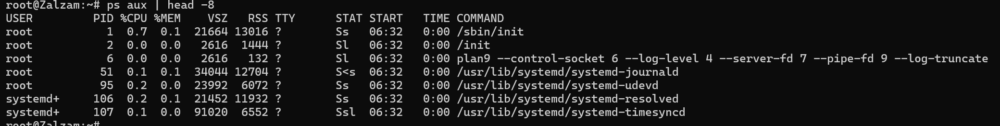
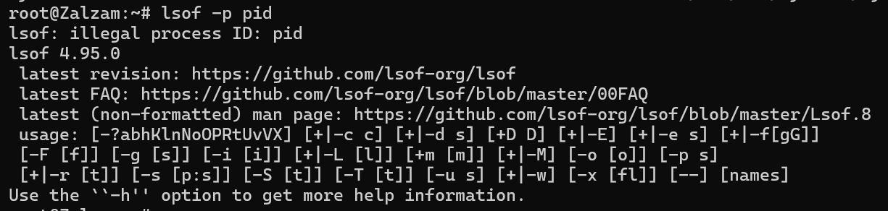

# Proses Kontrol

Proses kontrol dalam jaringan mengacu pada serangkaian mekanisme dan prosedur yang diterapkan untuk memastikan kinerja, keamanan, dan efisiensi jaringan komputer. Di tiap proses, terdiri dari adress dan data structure di kernel. 

Data Structure yang ada di dalam kernel, bisa memantau proses, dan mencatat berbagai informasi:
  1. Alamat space map proses
  2. Status proses: proses berjalan, jeda, dll.
  3. Prioritas proses
  4. Informasi sumber daya yang digunakan. Misalnya seperti CPU, memori, dsb.
  5. Kumpulan sinyal yang yang diblokir
  6. ID user yang memulai proses

### PID (Process ID Number)
Setiap proses, ada ID unik berupa bilangan bulat di kernel. Digunakan untuk mengirim signal ke sebuah proses.
Namespaces process memungkinkan ada proses berbeda dan punya PID yang sama, Namespaces dipakai untuk membuat kontainer yang digunakan untuk menjalankan beberapa contoh aplikasi pada sistem yang sama

### PPID (Parent Process ID Number)
Tiap proses dikaitkan dengan parent process. Nomor ID parent process, yakni PID. PPID dipakai untuk merujuk ke parent process di panggilan sistem, seperti mengirim signal.

### UID dan EUID (User ID dan Effective Usr ID)
ID user (UID) adalah ID yang memulai proses. EUID merupakan ID user yang dugunakan proses untuk menentukan sumber daya yang dapat diakses oleh proses. Selain itu, EUID dipakai untuk mengontrol akses ke berkas, port jaringan, dsb.

# Life Cycle of a Process
Dalam new process, ada namanya **fork system** yang membuat salinan dari proses asli. Salinan yang dibuat, identik dengan parent process. Linux System menggunakan clone, superset dari fork yang menangani thread dan menyertakan fitur tambahan. **Fork** ada di kernel untuk backward compability tetapi memanggil **clone** secara internal.

### Signal
Cara mengirim pemberitahuan ke suatu proses.
- Dapat dikirim antar proses untuk komunikasi
- Dikirim oleh driver terminal untuk berhenti, jeda, menyela, atau menangguhkan proses
- Dikirim oleh administrator (kill)
- Dikirim oleh kernel saat proses melakukan pelanggaran. Misal pembagian dengan nol
- Dikirim oleh kernel untuk memberi tahu proses tentang kondisi seperti kematian suatu proses anak atau ketersediaan data pada saluran I/O.

Perbedaan Sinyal KILL, INT, TERM, HUP, dan QUIT;

- KILL tidak dapat diblokir dan menghentikan proses di tingkat kernel. 
- INT dikirim oleh driver terminal saat pengguna mengetik (Permintaan untuk mengakhiri operasi saat ini. Program harus berhenti (jika menangkap sinyal) atau membiarkan dirinya dimatikan, yang merupakan default jika sinyal tidak tertangkap). Program yang memiliki baris perintah interaktif (seperti shell) harus menghentikan apa yang sedang dilakukannya, membersihkan, dan menunggu masukan pengguna lagi.
- TERM yakni permintaan untuk menghentikan eksekusi sepenuhnya. Proses penerima diharapkan akan membersihkan statusnya dan keluar.
- HUP dikirim ke suatu proses saat terminal kontrol ditutup. Awalnya digunakan untuk menunjukkan "putusnya sambungan telepon", dan sekarang digunakan untuk memerintahkan proses daemon untuk mengakhiri dan memulai ulang, memperhitungkan konfigurasi baru. 
- QUIT mirip dengan TERM, kecuali bahwa ia secara default menghasilkan core dump jika tidak tertangkap.

# PS (Monitoring Processes)
Perintah ps untuk memantau proses, dapat menampilkan PID, UID, prioritas, dan terminal kontrol suatu proses. Memberi tahu berapa banyak memori yang digunakan di suatu proses, banyak waktu CPU yang sudah dikonsumsi, dan status saat ini.

Ada gambaran umum tentang sistem dengan ps aux. a untuk menunjukkan proses semua user, u untuk informasi terperinci tiap proses, x untuk menujukkan proses yang tidak terkait dengan terminal 
 

Ada argumen lax, untuk informasi lebih teknis tentang proses dan sedikit lebih cepat daripada aux karena tidak perlu menyelesaikan username dan grup. 

Untuk proses tertentu, bisa menggunakan grep untuk filter output ps
`$ ps aux | grep -v grep | grep firefox`

Menentukan PID suatu proses dengan menggunakan pgrep atau pidof.
`$ pgrep firefox`
`$ pidof /usr/bin/firefox`

## Interactive Monitoring
Perintah top menampilkan informasi sistem secara real-time, termasuk ringkasan sistem dan daftar proses yang sedang berjalan. Informasi yang ditampilkan dapat dikonfigurasi oleh user dan disimpan agar tetap tersedia setelah restart. Secara default, tampilan diperbarui setiap 1-2 detik tergantung pada sistem.
Sebagai alternatif, **htop** adalah penampil proses interaktif berbasis teks yang membutuhkan ncurses. Daripada top, htop memiliki antarmuka yang lebih intuitif, mendukung scrolling vertikal dan horizontal untuk melihat seluruh proses beserta command line lengkapnya, serta menawarkan lebih banyak opsi operasi.

## Nice and renice
**Niceness dalam Prioritas Proses**  
Niceness yakni nilai numerik yang memberi petunjuk ke kernel terkait prioritas suatu process. Nilai tinggi (+19 di Linux) berarti prioritas rendah, sedangkan nilai rendah atau negatif (-20 di Linux) berarti prioritasnya tinggi. Proses dengan prioritas rendah mendapatkan lebih sedikit waktu CPU dibandingkan proses dengan prioritas tinggi. Jika menjalankan tugas berat di latar belakang, menggunakan nilai niceness tinggi memungkinkan proses lain tetap berjalan lancar. 

## /proc file system
**/proc: Pseudo-Filesystem untuk Informasi Sistem**  
Di Linux, **ps** dan **top** membaca informasi status proses dari **/proc**, sebuah pseudo-filesystem yang menyajikan data tentang keadaan sistem. Selain informasi proses, **/proc** juga berisi statistik sistem. Setiap proses direpresentasikan sebagai direktori bernama sesuai PID-nya, yang berisi berbagai file berisi data seperti command line, environment variables, dan file descriptors.

## Strace dan Truss
Untuk mengetahui apa yang dilakukan suatu proses, gunakan **strace** di Linux atau **truss** di FreeBSD dan akan melacak system calls dan sinyal yang diterima proses, berguna untuk debugging atau memahami cara kerja suatu program. 

## Runaway proses
Adakalanya, sebuah proses dapat berhenti merespons dan menggunakan 100% CPU, yang disebut **runaway process**. Akhirnya menyebabkan sistem menjadi lambat karena proses lain mendapat akses terbatas ke CPU. Untuk berhenti, pakai perintah **kill**. Jika proses tidak merespons sinyal **TERM**, gunakan sinyal **KILL** untuk memaksa berhenti. 
Kita bisa menyelidiki penyebab **runaway process**, pakai **strace** (Linux) atau **truss** (FreeBSD). Jika proses tersebut menghasilkan output berlebihan, ia bisa memenuhi seluruh filesystem. Gunakan **df -h** untuk memeriksa penggunaan filesystem. Jika penuh, cari file atau direktori terbesar dengan **du**. Untuk melihat file yang sedang dibuka oleh proses tersebut, gunakan **lsof**.

## Proses Periodic
### cron: schedule command 
Daemon **cron** (atau **crond** di RedHat) yakni alat tradisional untuk menjalankan perintah secara otomatis sesuai jadwal. **cron** berjalan sejak sistem dinyalakan dan terus aktif selama sistem hidup. Konfigurasi **cron** disimpan dalam file **crontab**, yang berisi daftar perintah beserta waktu eksekusinya. Perintah dalam **crontab** dijalankan oleh **sh** hampir semua yang bisa dilakukan di shell dapat dijadwalkan. Crontab untuk setiap pengguna disimpan di **/var/spool/cron** (Linux) atau **/var/cron/tabs** (FreeBSD).

### format of crontab
File **crontab** ada 5 kolom untuk menentukan hari, tanggal, dan waktu eksekusi, diikuti oleh perintah yang akan dijalankan pada interval tersebut.

#### crontab management
Perintah **crontab** digunakan untuk membuat, mengubah, dan menghapus crontab. Opsi **-e** digunakan untuk mengedit file crontab, **-l** untuk menampilkan isi crontab, dan **-r** untuk menghapus file crontab.

### System timer
Yakni file konfigurasi unit dengan akhiran **.timer**, digunakan sebagai alternatif **cron jobs** dan lebih fleksibel + kuat dibandingkan cron.  
Unit timer diaktifkan oleh unit **service** terkait, yang akan berjalan pada waktu yang ditentukan dalam unit timer. Timer juga bisa dipicu saat sistem boot atau oleh suatu event.  
Perintah **systemctl** digunakan untuk mengelola unit systemd, sedangkan opsi **list-timers** digunakan untuk menampilkan timer yang aktif.

### Mengirim email
Kita bisa mengirim email secara otomatis berisi output laporan harian atau hasil eksekusi perintah menggunakan **cron** atau **systemd timers**.

### Cleaning up a sistem file
Kita bisa menggunakan **cron** atau **systemd timers** untuk menjalankan skrip pembersihan filesystem. Misalnya, membuat skrip untuk menghapus isi direktori **trash** setiap hari pada tengah malam.

### Rotating a log file
Rotasi log berarti membagi file log menjadi beberapa segmen berdasarkan ukuran atau tanggal, dengan menyimpan beberapa versi lama agar tetap tersedia. Karena rotasi log terjadi secara berkala, tugas ini dijadwalkan menggunakan **cron** atau **systemd timers**.

### Running batch jobs
Kalau ada beberapa perhitungan yang berjalan lama lebih baik dijalankan sebagai batch job. Misalnya, pesan yang menumpuk dalam antrean atau database dapat diproses sekaligus menggunakan **cron job** sebagai bagian dari proses **ETL (Extract, Transform, Load)** ke lokasi lain, misalnya seprti **data warehouse**.

### Backing up dan mirroring
Untuk mencadangkan direktori ke sistem jarak jauh secara otomatis. **Mirror** adalah salinan **byte-per-byte** dari sistem file atau direktori yang disimpan di sistem lain. Mirror dapat digunakan sebagai bentuk cadangan atau untuk mendistribusikan file ke beberapa sistem. Eksekusi **rsync** secara berkala dapat digunakan untuk menjaga mirror tetap terbaru, alias up to date.
