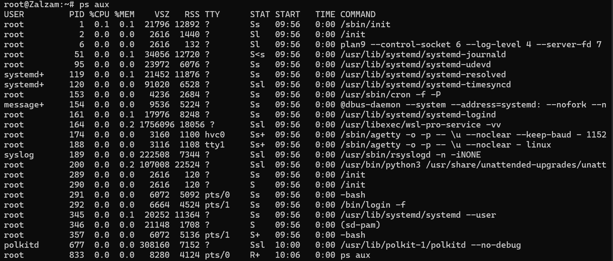
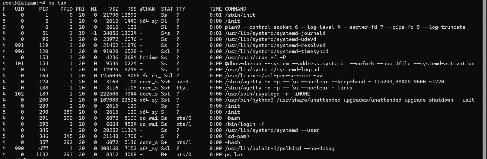

# Proses Kontrol

Proses kontrol dalam jaringan mengacu pada serangkaian mekanisme dan prosedur yang diterapkan untuk memastikan kinerja, keamanan, dan efisiensi jaringan komputer. Di tiap proses, terdiri dari adress dan data structure di kernel. 

Data Structure yang ada di dalam kernel, bisa memantau proses, dan mencatat berbagai informasi:
  1. Alamat space map proses
  2. Status proses: proses berjalan, jeda, dll.
  3. Prioritas proses
  4. Informasi sumber daya yang digunakan. Misalnya seperti CPU, memori, dsb.
  5. Kumpulan sinyal yang yang diblokir
  6. ID user yang memulai proses

### PID (Process ID Number)
Setiap proses, ada ID unik berupa bilangan bulat di kernel. Digunakan untuk mengirim signal ke sebuah proses.
Namespaces process memungkinkan ada proses berbeda dan punya PID yang sama, Namespaces dipakai untuk membuat kontainer yang digunakan untuk menjalankan beberapa contoh aplikasi pada sistem yang sama

### PPID (Parent Process ID Number)
Tiap proses dikaitkan dengan parent process. Nomor ID parent process, yakni PID. PPID dipakai untuk merujuk ke parent process di panggilan sistem, seperti mengirim signal.

### UID dan EUID (User ID dan Effective Usr ID)
ID user (UID) adalah ID yang memulai proses. EUID merupakan ID user yang dugunakan proses untuk menentukan sumber daya yang dapat diakses oleh proses. Selain itu, EUID dipakai untuk mengontrol akses ke berkas, port jaringan, dsb.

# Life Cycle of a Process
Dalam new process, ada namanya **fork system** yang membuat salinan dari proses asli. Salinan yang dibuat, identik dengan parent process. Linux System menggunakan clone, superset dari fork yang menangani thread dan menyertakan fitur tambahan. **Fork** ada di kernel untuk backward compability tetapi memanggil **clone** secara internal.

### Signal
Cara mengirim pemberitahuan ke suatu proses.
- Dapat dikirim antar proses untuk komunikasi
- Dikirim oleh driver terminal untuk berhenti, jeda, menyela, atau menangguhkan proses
- Dikirim oleh administrator (kill)
- Dikirim oleh kernel saat proses melakukan pelanggaran. Misal pembagian dengan nol
- Dikirim oleh kernel untuk memberi tahu proses tentang kondisi seperti kematian suatu proses anak atau ketersediaan data pada saluran I/O.

Perbedaan Sinyal KILL, INT, TERM, HUP, dan QUIT;

- KILL tidak dapat diblokir dan menghentikan proses di tingkat kernel. 
- INT dikirim oleh driver terminal saat pengguna mengetik (Permintaan untuk mengakhiri operasi saat ini. Program harus berhenti (jika menangkap sinyal) atau membiarkan dirinya dimatikan, yang merupakan default jika sinyal tidak tertangkap). Program yang memiliki baris perintah interaktif (seperti shell) harus menghentikan apa yang sedang dilakukannya, membersihkan, dan menunggu masukan pengguna lagi.
- TERM yakni permintaan untuk menghentikan eksekusi sepenuhnya. Proses penerima diharapkan akan membersihkan statusnya dan keluar.
- HUP dikirim ke suatu proses saat terminal kontrol ditutup. Awalnya digunakan untuk menunjukkan "putusnya sambungan telepon", dan sekarang digunakan untuk memerintahkan proses daemon untuk mengakhiri dan memulai ulang, memperhitungkan konfigurasi baru. 
- QUIT mirip dengan TERM, kecuali bahwa ia secara default menghasilkan core dump jika tidak tertangkap.

# PS (Monitoring Processes)
Perintah ps untuk memantau proses, dapat menampilkan PID, UID, prioritas, dan terminal kontrol suatu proses. Memberi tahu berapa banyak memori yang digunakan di suatu proses, banyak waktu CPU yang sudah dikonsumsi, dan status saat ini.

Ada gambaran umum tentang sistem dengan ps aux. a untuk menunjukkan proses semua user, u untuk informasi terperinci tiap proses, x untuk menujukkan proses yang tidak terkait dengan terminal 
 

Ada argumen lax, untuk informasi lebih teknis tentang proses dan sedikit lebih cepat daripada aux karena tidak perlu menyelesaikan username dan grup. 

Untuk proses tertentu, bisa menggunakan grep untuk filter output ps
`$ ps aux | grep -v grep | grep firefox`

Menentukan PID suatu proses dengan menggunakan pgrep atau pidof.
`$ pgrep firefox
`$ pidof /usr/bin/firefox`

# Pemantauan interaktif
