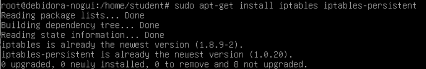

  <h1 style="text-align: center;font-weight: bold">Laporan Praktikum Workshop Administrasi Jaringan</h1>

 

  
  
  
  <h3 style="text-align: center;">Dosen Pengampu:</h3>
  <h4 style="text-align: center;">Dr. Ferry Astika Saputra, S.T., M.Sc.</h4>

  <h3 style="text-align: center;">Disusun Oleh:</h3>
  

    <strong>Zalfail Mumtaza Attamami</strong> 
    <strong>3123600003</strong>
  

<h3 style="text-align: center;line-height: 1.5">Politeknik Elektronika Negeri Surabaya Departemen Teknik Informatika Dan Komputer Program Studi Teknik Informatika 2024/2025</h3>
  

### 1. Konfigurasi VM 1 (Server)
Virtual Machine No GUI (CLI) sebagai server.
Menggunakan dua network adapter:
Adapter 1: Bridge Adapter
Adapter 2: Internal Network

**Bridged Adapter** berguna untuk memberikan konektivitas jaringan yang setara dengan perangkat fisik lain di jaringan lokal, memungkinkan komunikasi dua arah dan simulasi lingkungan jaringan yang realistis (untuk koneksi langsung ke jaringan luar). **Internal Network** untuk membuat jaringan di dalam komputer sendiri, terpisah dari jaringan luar.

#### Konfigurasi IP Address

1. Cek IP Address dengan perintah **ip a**

   

2. Tambahkan file `nano -l -w /etc/network/interfaces`

   

3. Mengaktifkan forwarding di Server dengan `nano -l -w /etc/sysctl.conf`

    

4. Instalasi iptables

    

5. Menambah kode ke `/etc/iptables/rules.v4` menggunakan perintah `sudo nano -l -w /etc/iptables/rules.v4.`

    

6. Menjalankan perintah `sudo iptables-restore < /etc/iptables/rules.v4`

    

7. Melakukan reboot VM dengan perintah sudo reboot

#### Instalasi NTP Client

8. Instal NTP
   
   

9. Perintah `sudo nano /etc/ntpsec/ntp.conf` untuk set server

   

10. Menjalankan perintah `systemctl status ntpsec` 

   

11. Melihat sudah tersambung dengan server, pakai perintah `ntpq -p`

   

#### Konfigurasi File Samba di VM 1 (No GUI)

1. Instalasi samba
   
   

2. Membuat folder share dan mengatur permission

   

   Sebelumnya, saya sudah membuat directory /home/share, maka dari
   itu dalam output tertera bahwa **file exist**

3. Menambahkan konfigurasi file `etc/samba/smb.conf`

   

4. Restart layanan samba

   

#### Konfigurasi DNS Server pada VM 1
1. Instalasi paket DNS Server

   

2. Menambah konfigurasi pada file `/etc/bind/named.conf`

   

3. Mengedit file opsi `/etc/bind/named/conf.options`

   

4. Membuat internal zone di `/etc/bind/named.conf.internal-zones`

   

5. Menambahkan opsi `-4` pada file `/etc/default/named`

   

6. Membuat konfigurasi domain lokal

   

7. Membuat file konfigurasi berdasarkan IP address

   

### Konfigurasi VM 2 (client)

   

Melakukan ping

   

   

   

   

   
