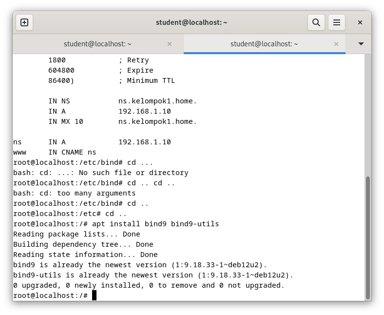
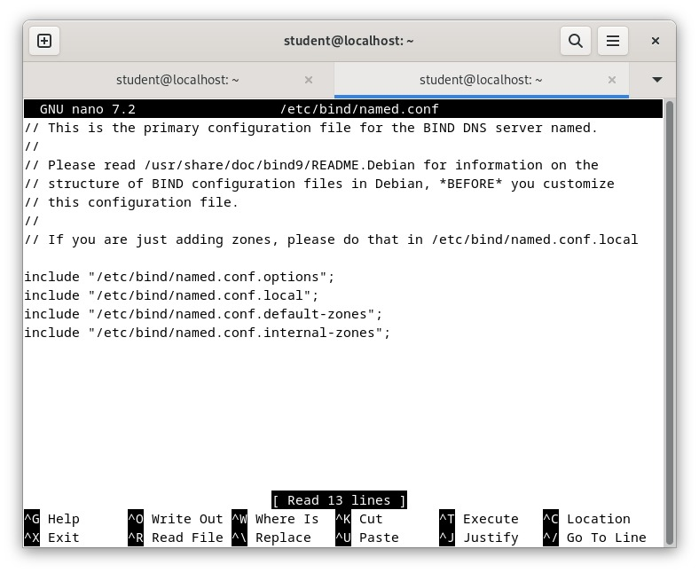
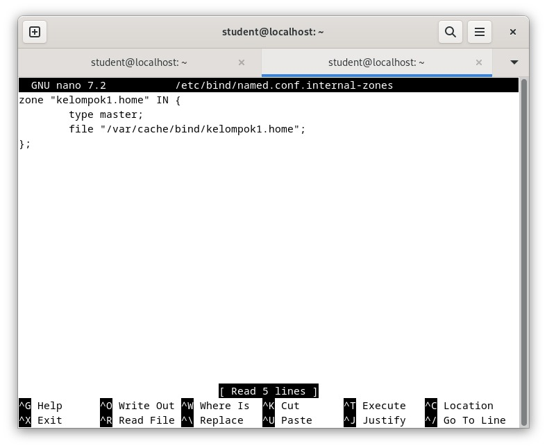
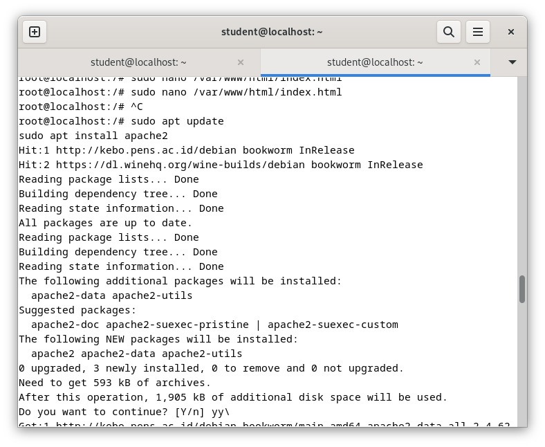
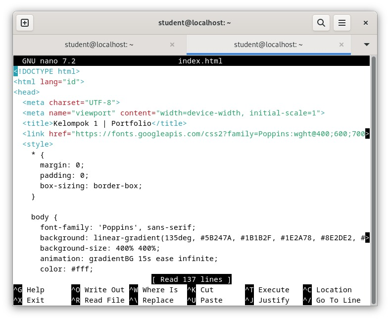
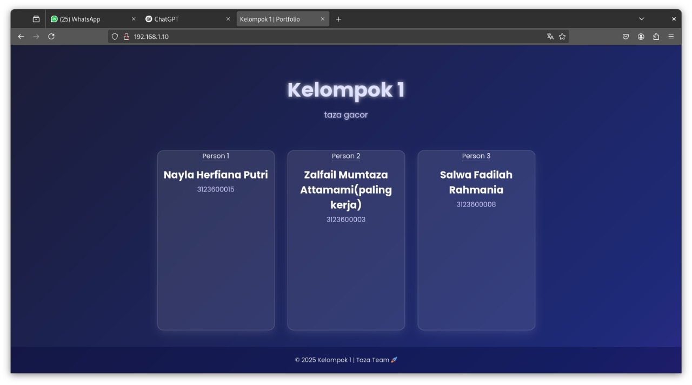

  <h1 style="text-align: center;font-weight: bold">Laporan Praktikum Workshop Administrasi Jaringan</h1>
  <h4 style="text-align: center;">Laporan Praktikum DNS</h4>

 

  
  
  
  <h3 style="text-align: center;">Dosen Pengampu:</h3>
  <h4 style="text-align: center;">Dr. Ferry Astika Saputra, S.T., M.Sc.</h4>

  <h3 style="text-align: center;">Kelompok 1:</h3>
  

    <strong>Zalfail Mumtaza Attamami (3123600003)</strong> 
    <strong>Salwa Fadhila Rahmania (3123600008)</strong> 
    <strong>Nayla Herfiana Putri (3123600015)</strong>
  

<h3 style="text-align: center;line-height: 1.5">Politeknik Elektronika Negeri Surabaya Departemen Teknik Informatika Dan Komputer Program Studi STr. Teknik Informatika 2024/2025</h3>
  

---

## Setting DNS kelompok 1

### Langkah-langkah :

1. Instalasi BIND menggunakan perintah `sudo apt -y install bind9 bind9utils`.
    
    
    

1. Konfigurasi BIND untuk network internal dalam named.conf menggunakan perintah `sudo nano /etc/bind/named.conf` untuk menambahkan `include "/etc/bind/named.conf.internal-zones";`.
    
    
    

1. Konfigurasi BIND untuk network internal dalam named.conf.options menggunakan perintah `sudo nano /etc/bind/named.conf.options` untuk menambahkan internal network dan forwarders :
    
    .jpeg)
    

1. Konfigurasi BIND untuk network internal dalam named.conf.internal-zones menggunakan perintah `sudo nano /etc/bind//etc/bind/named.conf.internal-zones` untuk menambahkan :
    
    
    

1. Konfigurasi BIND untuk network internal dalam /default/named menggunakan perintah `sudo nano /etc/default/named` untuk menambahkan “-4” : 
    
    .jpeg)
    

1. Melakukan check dari konfigurasi yang sudah dilakukan dengan cara `named-checkconf` , apabila konfigurasi sudah benar maka check tidak menunjukkan hasil yang salah :
    
    .jpeg)
    

1. Membuat file zona yang digunakan server untuk menyelesaikan alamat IP dari nama domain, menggunakan perintah `sudo nano /var/cache/bind/kelompok1.home` 
    
    .jpeg)
    

1. Restart BIND untuk menyimpan perubahan menggunakan `sudo systemctl restart named.` :
    
    .jpeg)
    

1. Merubah pengaturan DNS untuk merujuk ke DNS sendiri pada `sudo nano /etc/resolv.conf` 

1. Melakukan `dig kelompok1.home`  maka hasilny ANSWER 1 yang artinya Sukses dijalankan :
    
    .jpeg)
    

---

## Melakukan Testing antar kelompok

### Langkah - langkah :

1. Install Apache 2 untuk membuat dashboard
    
    
    

1. Membuat dashboard html untuk tampilan 192.168.1.10
    
    
    

1. hasil dari konfigurasi html 
    
    
    

1. Ganti `/etc/resolv.conf` untuk bisa mengakses domain dengan nama `kelompok1.home.`
    
    
    

1. Melakukan restart network dengan `systemctl restart networking` lalu restart web dengan `systemctl restart apache2`
    
    
    

1. Melakukan Testing network dengan kelompok lain menggunakan `dig kelompokX.home`
    
    
    

1. Hasil domain name berubah menjadi kelompok1.home
    
    
    

1. Hasil memanggil domain kelompok lain, contoh kelompok3.home
    
    